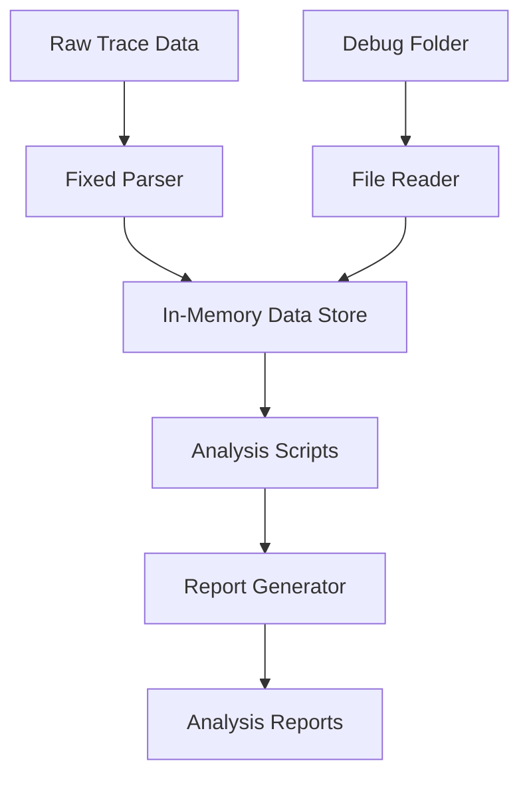

# Design Document

## Overview

The Kiro System Analysis feature will systematically analyze approximately 9,000 lines of trace data from `kiro_full_trace.jsonl` and all contents of the `debug/` folder to produce comprehensive reports about Kiro's system behavior, API patterns, prompt templates, context injection mechanisms, and complete operation sequences.

The analysis will be implemented as a multi-stage data processing pipeline that first fixes and enhances the existing trace parser, then extracts structured data, and finally generates detailed reports covering all aspects of Kiro's operation.

## Architecture

### Simple Analysis Pipeline



### Component Architecture

**Data Processing:**
- Fix existing trace parser for binary data
- Simple file readers for debug data
- In-memory JavaScript objects for data storage

**Analysis:**
- Direct JavaScript analysis functions
- String matching and regex for pattern detection
- Simple correlation logic for API sequences
- Basic text comparison for prompt extraction

**Output:**
- Markdown report generators
- JSON output for structured data
- Simple visualization with text-based charts

## Components and Interfaces

### Enhanced Trace Parser

**Purpose:** Fix the existing `/tmp/parse-streaming-trace.js` to properly handle binary data and extract complete information from `kiro_full_trace.jsonl`.

**Simple Improvements:**
- Fix binary chunk decoding issues
- Properly reconstruct streaming messages
- Extract all JSON data from chunks
- Correlate requests with responses by requestId

**Data Structure:**
```javascript
// Simple in-memory storage
const analysisData = {
  requests: [],
  responses: [],
  conversations: [],
  toolUsage: [],
  systemEvents: []
};
```

### Debug Data Processor

**Purpose:** Read and process all debug files into simple JavaScript objects.

**Simple Processing:**
- Read all `.chat` files and parse JSON
- Parse debug.log line by line
- Process execution-log.json
- Store everything in simple arrays and objects

### Prompt Template Extractor

**Purpose:** Find prompt templates using simple string matching techniques.

**Simple Approach:**
- Look for common prefixes in system messages
- Use regex to find template patterns like `[variable]` or `{variable}`
- Group similar prompts by exact string matching
- Extract context injection patterns by looking for specific keywords

**Basic Implementation:**
```javascript
function extractPromptTemplates(messages) {
  const templates = [];
  const systemMessages = messages.filter(m => m.type === 'system');
  
  // Find common prefixes
  const prefixes = findCommonPrefixes(systemMessages);
  
  // Extract templates
  prefixes.forEach(prefix => {
    const template = extractTemplate(prefix);
    templates.push(template);
  });
  
  return templates;
}
```

### API Sequence Analyzer

**Purpose:** Identify complete API operation flows by correlating requests and responses.

**Simple Correlation:**
- Group requests/responses by conversationId and requestId
- Sort by timestamp to create sequences
- Identify operation types by analyzing request patterns
- Document step-by-step API flows

**Basic Implementation:**
```javascript
function analyzeAPISequences(requests, responses) {
  const sequences = {};
  
  // Group by conversation
  requests.forEach(req => {
    const convId = req.conversationId;
    if (!sequences[convId]) sequences[convId] = [];
    sequences[convId].push(req);
  });
  
  // Correlate with responses and create flows
  return Object.values(sequences).map(createAPIFlow);
}
```

### Context Injection Analyzer

**Purpose:** Find how context is passed between interactions using simple pattern matching.

**Simple Analysis:**
- Look for context objects in request bodies
- Identify file paths and document references
- Track context changes between requests
- Find context injection keywords and patterns

### Prompt Template Extractor

**Purpose:** Extract and categorize all prompt templates, system prompts, and user prompts from trace and debug data.

**Extraction Targets:**
- System prompt templates
- User message patterns
- Context injection prompts
- Tool usage prompts

**Interface:**
```typescript
interface PromptExtractor {
  extractSystemPrompts(data: ParsedTrace[]): SystemPrompt[];
  identifyPromptTemplates(conversations: ConversationData[]): PromptTemplate[];
  analyzePromptEffectiveness(prompts: Prompt[], responses: Response[]): PromptAnalysis;
}

interface PromptTemplate {
  type: 'system' | 'user' | 'context' | 'tool';
  template: string;
  variables: string[];
  usageCount: number;
  contexts: string[];
}
```

### Context Injection Analyzer

**Purpose:** Analyze how context is managed, passed, and transformed throughout system interactions.

**Analysis Areas:**
- Context sources and types
- Context transformation patterns
- Context preservation mechanisms
- Context usage effectiveness

**Interface:**
```typescript
interface ContextAnalyzer {
  identifyContextSources(data: ConversationData[]): ContextSource[];
  analyzeContextFlow(conversations: ConversationData[]): ContextFlow[];
  extractContextPatterns(execData: ExecutionData[]): ContextPattern[];
}

interface ContextFlow {
  sourceType: string;
  transformations: ContextTransformation[];
  destinations: string[];
  preservationMechanism: string;
}
```

## Data Models

### Simple Data Structures

```javascript
// Simple objects for storing analysis data
const analysisData = {
  // From trace file
  apiCalls: [
    {
      requestId: 'string',
      timestamp: 'string',
      method: 'string',
      endpoint: 'string',
      requestBody: {},
      responseStatus: 200,
      conversationId: 'string'
    }
  ],
  
  // From debug files
  conversations: [
    {
      executionId: 'string',
      messages: [],
      toolUsage: [],
      context: []
    }
  ],
  
  // Extracted patterns
  promptTemplates: [
    {
      template: 'string',
      variables: [],
      usageCount: 0,
      examples: []
    }
  ],
  
  // API sequences
  operationFlows: [
    {
      operationType: 'create-hook',
      steps: [
        { endpoint: '/api/endpoint1', method: 'POST', body: {} },
        { endpoint: '/api/endpoint2', method: 'GET', response: {} }
      ]
    }
  ]
};
```

## Error Handling

### Simple Error Handling
- Try/catch blocks around JSON parsing
- Skip malformed entries and log them
- Continue processing even if some data is missing
- Basic validation of required fields

## Testing Strategy

### Manual Validation
- Spot-check parsed data against original files
- Verify report content makes sense
- Test with sample data first
- Review output for completeness

## Implementation Approach

### Phase 1: Fix Parser
- Copy and enhance `/tmp/parse-streaming-trace.js` locally
- Fix binary data handling for `kiro_full_trace.jsonl`
- Test with full trace file

### Phase 2: Process Debug Data
- Read all debug files
- Extract structured data
- Store in simple JavaScript objects

### Phase 3: Analysis
- Run analysis functions on collected data
- Extract patterns and sequences
- Generate insights

### Phase 4: Reports
- Create markdown reports
- Include key findings and examples
- Generate summary statistics