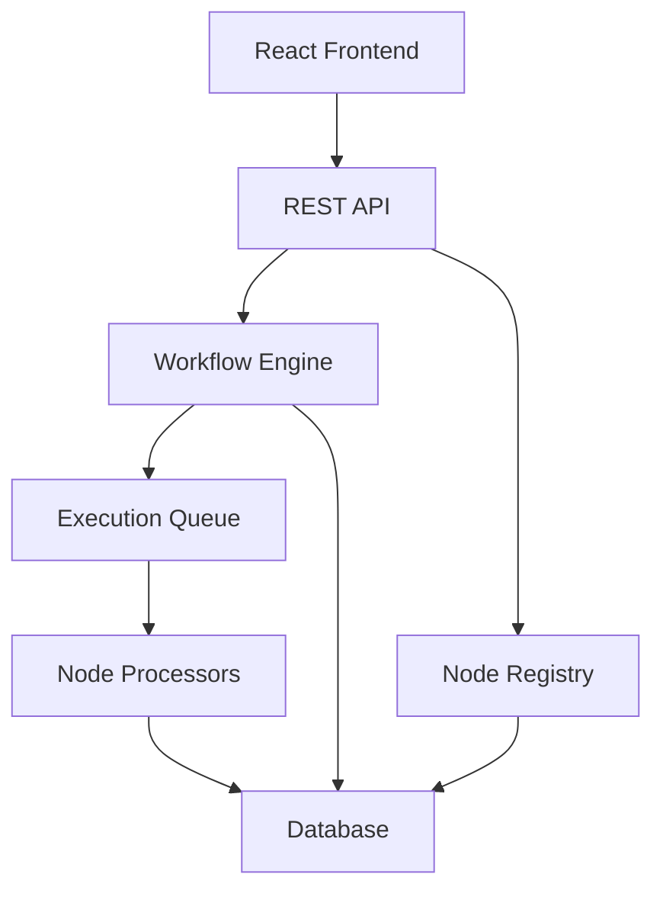

# Design Document

## Overview

The n8n workflow system will be implemented as a web-based application with a React frontend for the visual workflow builder and a Node.js backend for workflow execution and management. The system follows a modular architecture where workflows are composed of interconnected nodes, each representing a specific operation or transformation.

## Architecture

The system consists of four main layers:

1. **Presentation Layer**: React-based visual workflow builder with drag-and-drop interface
2. **API Layer**: RESTful API endpoints for workflow management and execution
3. **Business Logic Layer**: Workflow engine, node processors, and execution orchestrator
4. **Data Layer**: Database for workflow definitions, execution history, and configuration



## Components and Interfaces

### Frontend Components

**WorkflowCanvas**
- Manages the visual workflow builder interface
- Handles drag-and-drop operations for nodes
- Renders connections between nodes
- Provides zoom and pan functionality

**NodePalette**
- Displays available node types in categorized groups
- Supports search and filtering of node types
- Provides node documentation and examples

**NodeConfigPanel**
- Dynamic configuration interface based on node type
- Form validation and error handling
- Real-time parameter updates

**ExecutionMonitor**
- Real-time execution status display
- Progress indicators for each node
- Error highlighting and debugging information

### Backend Components

**WorkflowEngine**
- Core execution orchestrator
- Manages workflow state and transitions
- Handles error recovery and retry logic
- Supports parallel and sequential execution paths

**NodeRegistry**
- Registry of available node types and their definitions
- Plugin system for custom node types
- Node validation and schema management

**ExecutionQueue**
- Manages workflow execution scheduling
- Handles concurrent execution limits
- Provides execution prioritization

**TriggerManager**
- Manages webhook and scheduled triggers
- Event subscription and notification system
- Trigger condition evaluation

## Data Models

### Workflow Model
```typescript
interface Workflow {
  id: string;
  name: string;
  description?: string;
  nodes: WorkflowNode[];
  connections: Connection[];
  triggers: Trigger[];
  settings: WorkflowSettings;
  createdAt: Date;
  updatedAt: Date;
}
```

### WorkflowNode Model
```typescript
interface WorkflowNode {
  id: string;
  type: string;
  name: string;
  position: { x: number; y: number };
  parameters: Record<string, any>;
  disabled: boolean;
}
```

### Connection Model
```typescript
interface Connection {
  id: string;
  sourceNodeId: string;
  sourceOutput: string;
  targetNodeId: string;
  targetInput: string;
}
```

### Execution Model
```typescript
interface WorkflowExecution {
  id: string;
  workflowId: string;
  status: 'running' | 'completed' | 'failed' | 'cancelled';
  startedAt: Date;
  completedAt?: Date;
  nodeExecutions: NodeExecution[];
  error?: string;
  triggeredBy: 'manual' | 'webhook' | 'schedule';
}
```

### NodeExecution Model
```typescript
interface NodeExecution {
  nodeId: string;
  status: 'pending' | 'running' | 'completed' | 'failed' | 'skipped';
  startedAt?: Date;
  completedAt?: Date;
  inputData: any;
  outputData?: any;
  error?: string;
  executionTime?: number;
}
```

## Node Types

### HTTP Request Node
- Supports GET, POST, PUT, DELETE methods
- Configurable headers, authentication, and request body
- Response data transformation and error handling

### Data Transform Node
- JavaScript expression evaluation
- JSON path operations
- Data mapping and filtering capabilities

### Conditional Node
- Boolean expression evaluation
- Multiple output paths based on conditions
- Support for complex logical operations

### Timer/Schedule Node
- Cron expression scheduling
- Interval-based triggers
- One-time delayed execution

### Webhook Node
- HTTP endpoint creation for external triggers
- Request validation and authentication
- Payload transformation and routing

## Error Handling

### Execution Errors
- Node-level error capture and logging
- Workflow-level error propagation control
- Retry mechanisms with exponential backoff
- Dead letter queue for failed executions

### Validation Errors
- Schema validation for node parameters
- Connection validation (type compatibility)
- Circular dependency detection
- Required parameter enforcement

### System Errors
- Database connection failures
- External service timeouts
- Memory and resource constraints
- Graceful degradation strategies

## Testing Strategy

### Unit Testing
- Individual node processor testing
- Workflow engine component testing
- Data model validation testing
- API endpoint testing

### Integration Testing
- End-to-end workflow execution testing
- Database integration testing
- External service integration testing
- Frontend-backend integration testing

### Performance Testing
- Concurrent workflow execution testing
- Large workflow handling
- Memory usage optimization
- Response time benchmarking

### User Acceptance Testing
- Workflow creation and editing flows
- Execution monitoring and debugging
- Error handling and recovery scenarios
- Cross-browser compatibility testing