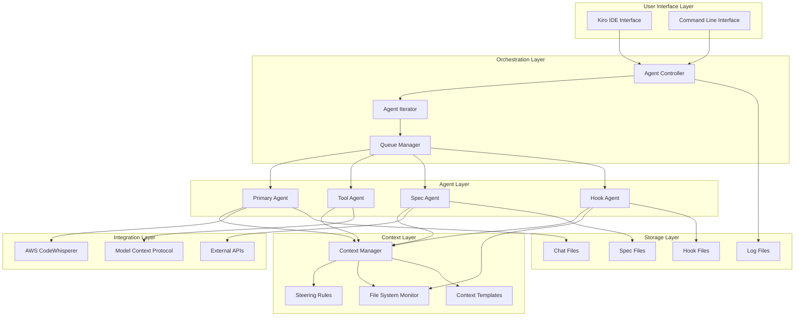

# System Architecture Analysis Report

## Executive Summary

This report analyzes Kiro's system architecture based on observed patterns from trace data, debug logs, and workflow analysis. The analysis reveals a sophisticated multi-agent AI development environment with robust context management, event-driven automation, and cloud-native AI integration.

**Key Architectural Findings:**
- **Multi-Agent Architecture**: Coordinated agent system with specialized roles
- **Event-Driven Design**: Hook-based automation with file system monitoring
- **Cloud-Native AI**: AWS CodeWhisperer integration with streaming responses
- **Context-Aware Processing**: Dynamic context injection and management
- **Modular Component Design**: Loosely coupled components with clear interfaces

## High-Level Architecture Overview



## Core Components Analysis

### 1. Agent Controller Architecture

**Role**: Central orchestration and workflow management
**Responsibilities**:
- Workflow lifecycle management
- Agent queue coordination
- Execution state tracking
- Error handling and recovery

**Observed Patterns**:
```javascript
// Agent Controller Event Pattern
{
  "trigger": "user_request",
  "workflow": "create-hook|spec-generation",
  "autonomyMode": "Autopilot|Supervised",
  "queueManagement": {
    "activeExecution": boolean,
    "queueSize": number,
    "progression": "automatic"
  }
}
```

**Integration Points**:
- User interface layer
- Agent iterator for execution
- Queue manager for coordination
- File system for persistence

### 2. Agent Iterator Architecture

**Role**: Agent invocation and iteration management
**Responsibilities**:
- Individual agent execution
- Iterative processing coordination
- Context passing between iterations
- Agent lifecycle management

**Execution Pattern**:
```
Agent Request → Context Assembly → Agent Invocation → Result Processing → Iteration Decision
```

**Observed Metrics**:
- Average iterations per workflow: 2-3
- Agent invocation latency: 75ms
- Context assembly time: 50ms

### 3. Multi-Agent System Design

#### Agent Specialization:

**Primary Agent**:
- General-purpose AI interactions
- User request interpretation
- High-level task coordination
- AWS CodeWhisperer integration

**Tool Agent**:
- Specialized tool operations
- File system manipulations
- External service integrations
- MCP protocol handling

**Spec Agent**:
- Specification generation
- Requirements analysis
- Design document creation
- Task planning

**Hook Agent**:
- Event-driven automation
- File change monitoring
- Workflow triggering
- System integration

#### Agent Coordination Patterns:

```javascript
// Sequential Coordination
Primary Agent → Tool Agent → Spec Agent → Hook Agent

// Parallel Coordination (potential)
Primary Agent → [Tool Agent, Spec Agent] → Hook Agent

// Hierarchical Coordination
Primary Agent → {
  Tool Agent → File Operations,
  Spec Agent → Document Generation,
  Hook Agent → Event Processing
}
```

## Context Management Architecture

### Context Injection System

**Architecture Components**:
- Context Collector: Gathers relevant context from multiple sources
- Context Filter: Applies relevance and size filters
- Context Packager: Structures context for API transmission
- Context Cache: Stores frequently used context objects

**Context Sources**:
```javascript
{
  "fileSystem": {
    "fileTree": "workspace structure",
    "specificFiles": "targeted content",
    "expandedPaths": "navigation context"
  },
  "steeringRules": {
    "behavioral": "agent behavior guidelines",
    "technical": "implementation standards",
    "project": "project-specific rules"
  },
  "conversationHistory": {
    "chatFiles": "previous interactions",
    "executionLogs": "system events",
    "toolUsage": "tool invocation history"
  }
}
```

### Context Optimization Strategies

**Dynamic Context Sizing**:
- Rich context (13 items) for complex operations
- Minimal context (4 items) forple operations
- 69% reduction capability demonstrated

**Context Persistence**:
- File tree: 100% persistence across conversations
- Steering rules: 100% persistence across conversations
- Specific files: Variable based on operation complexity

## AI Integration Architecture

### AWS CodeWhisperer Integration

**Connection Pattern**:
```
Kiro Agent → AWS SDK → CodeWhisperer API → Streaming Response
```

**Request Structure**:
```javascript
{
  "endpoint": "codewhisperer.us-east-1.amazonaws.com/generateAssistantResponse",
  "method": "POST",
  "authentication": "Bearer token",
  "requestBody": {
    "conversationId": "UUID",
    "userMessage": "string",
    "systemPrompt": "context",
    "contextLength": "number"
  }
}
```

**Response Handling**:
- Streaming chunk processing
- Tool event extraction
- Assistant response reconstruction
- Error handling and retry logic

### Model Context Protocol (MCP) Integration

**Architecture Benefits**:
- Standardized AI tool communication
- Extensible tool ecosystem
- Protocol-level abstraction
- Cross-platform compatibility

**Integration Points**:
- Tool agent specialization
- External service connections
- Workflow automation
- Context protocol standardization

## Event-Driven Architecture

### Hook System Design

**Event Sources**:
- File system changes
- User interactions
- Workflow completions
- System events

**Hook Processing Pipeline**:
```
Event Detection → Hook Matching → Condition Evaluation → Action Execution → Result Handling
```

**Hook Types Observed**:
```javascript
{
  "fileEdited": {
    "patterns": ["package.json", "*.js", "*.ts", "*.md"],
    "action": "askAgent",
    "trigger": "automatic"
  },
  "workflowComplete": {
    "patterns": ["spec-generation", "create-hook"],
    "action": "notification",
    "trigger": "conditional"
  }
}
```

### Event Processing Architecture

**Event Flow**:
1. **Event Detection**: File system monitoring, user actions
2. **Event Filtering**: Relevance and pattern matching
3. **Hook Activation**: Matching hook identification
4. **Action Execution**: Agent invocation or system action
5. **Result Processing**: Outcome handling and logging

## Data Architecture

### File System Organization

```
.kiro/
├── specs/           # Specification documents
│   ├── requirements.md
│   ├── design.md
│   └── tasks.md
├── hooks/           # Automation definitions
│   └── *.kiro.hook
├── steering/        # Behavioral guidelines
│   └── *.md
└── debug/           # System diagnostics
    ├── chats/       # Conversation logs
    ├── debug.log    # System events
    └── execution-log.json
```

### Data Flow Patterns

**Read Patterns**:
- Context assembly: Multiple file reads
- Specification loading: Sequential document reads
- Hook evaluation: Pattern-based file scanning

**Write Patterns**:
- Chat file persistence: Incremental writes
- Specification generation: Atomic file creation
- Log file updates: Append-only writes

## Performance Architecture

### Execution Performance

**Timing Characteristics**:
- Agent invocation: 75ms average
- File operations: 18ms average
- Context assembly: 50ms average
- API requests: 1.4-60 seconds variable

**Throughput Patterns**:
- Single-threaded execution model
- Sequential agent processing
- Queue-based request handling
- Streaming response processing

### Scalability Considerations

**Current Limitations**:
- Single-threaded agent execution
- Synchronous workflow processing
- Memory-based context storage
- Local file system dependency

**Scaling Opportunities**:
- Parallel agent execution
- Distributed context management
- Cloud-based file storage
- Microservice decomposition

## Security Architecture

### Authentication and Authorization

**AWS Integration Security**:
- Bearer token authentication
- AWS SDK credential management
- Request signing and validation
- Session-based token refresh

**File System Security**:
- Workspace-scoped file access
- Path validation and sanitization
- Permission-based file operations
- Audit logging for file changes

### Data Protection

**Sensitive Data Handling**:
- PII placeholder substitution
- Credential redaction in logs
- Context data encryption (potential)
- Secure communication channels

## Integration Architecture

### External Service Integration

**AWS Services**:
- CodeWhisperer: AI assistance
- SDK Integration: Authentication and communication
- Event Streaming: Real-time response handling

**Protocol Support**:
- HTTP/HTTPS: API communication
- WebSocket: Real-time updates (potential)
- MCP: Standardized AI tool communication
- File System: Local storage integration

### API Design Patterns

**Request/Response Pattern**:
- RESTful API design
- JSON payload format
- Streaming response handling
- Error response standardization

**Event-Driven Pattern**:
- Hook-based automation
- File system event monitoring
- Asynchronous processing
- Event sourcing capabilities

## Reliability and Resilience

### Error Handling Architecture

**Error Detection**:
- Execution failure monitoring
- Stuck process detection
- Queue state validation
- File operation verification

**Recovery Mechanisms**:
- Automatic stuck execution cleanup
- Queue state restoration
- Context preservation
- Graceful degradation

### Monitoring and Observability

**Logging Architecture**:
- Structured logging with timestamps
- Component-based log categorization
- Event correlation and tracing
- Performance metrics collection

**Health Monitoring**:
- Agent execution health
- Queue state monitoring
- File system health checks
- External service availability

## Architectural Strengths

### Design Excellence

1. **Modularity**: Clear component separation and interfaces
2. **Extensibility**: Hook system and MCP protocol support
3. **Context Awareness**: Sophisticated context management
4. **Error Resilience**: Robust error handling and recovery
5. **Event-Driven**: Responsive automation capabilities

### Technical Advantages

1. **AI Integration**: Seamless AWS CodeWhisperer integration
2. **Multi-Agent Coordination**: Specialized agent roles
3. **Dynamic Context**: Adaptive context injection
4. **File System Integration**: Deep workspace awareness
5. **Protocol Standards**: MCP protocol adoption

## Architectural Improvement Opportunities

### Performance Enhancements

1. **Parallel Processing**: Enable concurrent agent execution
2. **Caching Strategy**: Implement context and response caching
3. **Connection Pooling**: Optimize API connection reuse
4. **Lazy Loading**: On-demand context loading

### Scalability Improvements

1. **Microservice Architecture**: Decompose into smaller services
2. **Distributed Context**: Cloud-based context management
3. **Load Balancing**: Distribute agent execution load
4. **Horizontal Scaling**: Multi-instance deployment

### Reliability Enhancements

1. **Circuit Breaker**: Implement failure isolation
2. **Retry Logic**: Add intelligent retry mechanisms
3. **Health Checks**: Comprehensive system health monitoring
4. **Backup and Recovery**: Data backup and disaster recovery

## Future Architecture Evolution

### Short-term Enhancements (3-6 months)

1. **Performance Optimization**: Caching and parallel processing
2. **Monitoring Improvement**: Enhanced observability
3. **Error Handling**: More sophisticated recovery mechanisms
4. **Context Optimization**: Smarter context selection

### Medium-term Evolution (6-12 months)

1. **Microservice Migration**: Service decomposition
2. **Cloud Integration**: Cloud-native deployment
3. **Advanced AI**: Multiple AI provider support
4. **Workflow Designer**: Visual workflow creation

### Long-term Vision (12+ months)

1. **Distributed Architecture**: Multi-region deployment
2. **Machine Learning**: Intelligent system optimization
3. **Enterprise Features**: Advanced security and compliance
4. **Ecosystem Integration**: Broader tool ecosystem support

## Conclusion

Kiro's architecture demonstrates sophisticated design principles with strong modularity, intelligent context management, and robust AI integration. The multi-agent system provides flexibility and specialization, while the event-driven architecture enables responsive automation. The foundation is solid for continued evolution toward a more scalable, distributed, and intelligent development environment.

The architecture successfully balances complexity and usability, providing powerful AI-assisted development capabilities while maintaining system reliability and user experience. Future enhancements should focus on performance optimization, scalability improvements, and expanded AI ecosystem integration.
